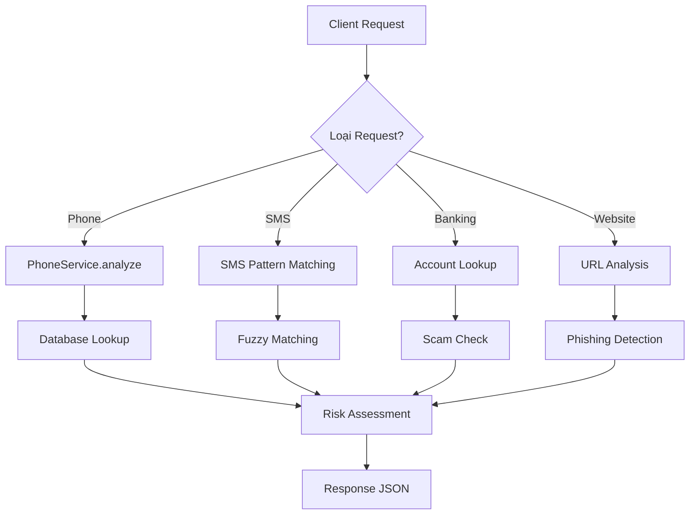

# 🛡️ Comprehensive Fraud Detection System - Complete Developer Guide

> **📖 Tài Liệu Dành Cho Developer** - Hướng dẫn chi tiết từ A-Z để hiểu và phát triển hệ thống phát hiện gian lận

---

## 🎯 **Dành Cho Ai?**

- 👨‍💻 **Backend Developers** muốn hiểu FastAPI + PostgreSQL
- 🔒 **Security Engineers** quan tâm đến fraud detection
- 📊 **Data Scientists** làm việc với pattern recognition
- 🚀 **Team Members** mới join project
- 🎓 **Students** học về web security và API development

---

## 📚 **Cách Đọc Tài Liệu Này**

### 🏃‍♂️ **Quick Start** (15 phút)
1. Đọc [Tổng Quan](#-tổng-quan-overview)
2. Xem [Kiến Trúc Hệ Thống](#️-kiến-trúc-hệ-thống-system-architecture)
3. Chạy [Setup Nhanh](#-setup-nhanh-5-phút)

### 🧠 **Deep Understanding** (2-3 giờ)
1. Đọc toàn bộ [Tech Stack](#️-tech-stack) 
2. Hiểu [Database Models](#-database-models)
3. Phân tích [API Endpoints](#-api-endpoints)
4. Tìm hiểu [Business Logic](#-phone-service---logic-phân-tích)

### 🚀 **Production Ready** (1 ngày)
1. Làm theo [Hướng dẫn Setup](#-cách-chạy-project)
2. Chạy [Testing](#-testing)
3. Đọc [Security & Performance](#-security-best-practices)
4. Hiểu [Deployment](#-mở-rộng-hệ-thống)

---

## 📋 Tổng Quan (Overview)

Đây là một **hệ thống phát hiện gian lận đa dạng** được xây dựng bằng **FastAPI** và **PostgreSQL**. Hệ thống có khả năng:

### 📱 **Phone Number Fraud Detection**
- 🔍 **Phân tích tự động** số điện thoại từ nhiều quốc gia
- 🌍 **Nhận diện vùng miền** dựa trên đầu số điện thoại
- ⚠️ **Đánh giá rủi ro** gian lận theo từng khu vực
- 💾 **Lưu trữ dữ liệu** người dùng và thông tin phân tích
- 🚨 **Xác nhận số rủi ro** từ báo cáo của người dùng

### 💬 **SMS Scam Detection** 
- 📝 **Phân tích nội dung** tin nhắn SMS
- 🎯 **Fuzzy matching** để phát hiện SMS tương tự
- 🔍 **Exact & pattern matching** cho độ chính xác cao
- 📊 **Crowdsourced reporting** từ người dùng

### 🏦 **Banking Scam Detection**
- 💳 **Theo dõi tài khoản** lừa đảo
- 🏛️ **Database ngân hàng** và số tài khoản rủi ro
- ⚡ **Real-time checking** tài khoản trước khi chuyển tiền
- 📈 **Báo cáo thống kê** theo ngân hàng

### 🌐 **Website Scam Detection**
- 🔗 **URL analysis** và phát hiện website giả mạo
- 🎭 **Phishing detection** cho các trang web lừa đảo
- 🏷️ **Label classification** (scam/safe)
- 🛡️ **Real-time protection** khi truy cập website

## 🏗️ Kiến Trúc Hệ Thống (System Architecture)

```
┌─────────────────┐    ┌─────────────────┐    ┌─────────────────┐
│   FastAPI App   │    │  Phone Service  │    │   PostgreSQL    │
│   (main.py)     │───▶│ (phone_service) │───▶│   Database      │
└─────────────────┘    └─────────────────┘    └─────────────────┘
         │                       │                       │
         ▼                       ▼                       ▼
┌─────────────────┐    ┌─────────────────┐    ┌─────────────────┐
│  Pydantic       │    │  SQLAlchemy     │    │    Alembic      │
│  Schemas        │    │  Models         │    │  Migrations     │
└─────────────────┘    └─────────────────┘    └─────────────────┘
```

### 🔄 Workflow Chính

#### **Luồng Xử Lý Request**


#### **Chi Tiết Từng Bước**

1. **📥 Nhận Request** 
   - Client gửi HTTP request (POST/GET)
   - FastAPI validate input qua Pydantic schemas
   - Dependency injection cung cấp database session

2. **🔍 Phân Tích Dữ Liệu**
   - **Phone**: Trích xuất đầu số, detect region
   - **SMS**: Pattern matching, fuzzy search
   - **Banking**: Account + Bank name lookup
   - **Website**: URL parsing, domain analysis

3. **🗃️ Tra Cứu Database**
   - Query relevant tables (phone_headings, sms_scams, etc.)
   - Apply business rules và logic
   - Cache frequently accessed data

4. **⚖️ Đánh Giá Rủi Ro**
   - **SAFE**: Trusted sources (VN numbers, verified sites)
   - **UNSAFE**: Known scam patterns
   - **UNKNOWN**: Chưa có data, conservative approach

5. **📤 Trả Về Kết Quả**
   - JSON response với risk level
   - Detailed analysis information
   - Suggestions for user action

---

## ⚡ **Setup Nhanh (5 phút)**

> **🎯 Mục tiêu**: Chạy được server và test API trong 5 phút

### **Prerequisites Check**
```bash
# Kiểm tra Python version (cần >= 3.11)
python --version

# Kiểm tra PostgreSQL
psql --version

# Kiểm tra Git
git --version
```

### **Quick Setup Commands**
```bash
# 1. Clone project
git clone <your-repo>
cd FraudDetection

# 2. Setup virtual environment
python -m venv .venv
.venv\Scripts\activate  # Windows
# source .venv/bin/activate  # macOS/Linux

# 3. Install dependencies
pip install -r config/requirements.txt
pip install requests  # For testing

# 4. Setup database (tạo database tên 'fastapi_db' trước)
alembic -c database/alembic.ini upgrade head

# 5. Populate initial data
python -c "from src.populate_headings import populate_phone_headings; populate_phone_headings()"

# 6. Start server
python -m uvicorn src.main:app --reload --port 8000

# 7. Test API (terminal mới)
python tests/test_new_scam_features.py
```

### **Verification**
- ✅ Server: http://localhost:8000
- ✅ API Docs: http://localhost:8000/docs
- ✅ Test results: All endpoints working

---

## 🛠️ Tech Stack

### Backend Framework
- **FastAPI 0.104.1** - Modern, fast web framework cho Python
- **Uvicorn 0.24.0** - ASGI server cho production

### Database & ORM
- **PostgreSQL** - Relational database
- **SQLAlchemy 2.0.25+** - Python SQL toolkit và ORM
- **psycopg2-binary 2.9.9+** - PostgreSQL adapter cho Python
- **Alembic 1.12.1** - Database migration tool

### Data Validation
- **Pydantic 2.5.0+** - Data validation sử dụng Python type hints

### 🤔 **Tại Sao Chọn Tech Stack Này?**

#### **FastAPI vs Django/Flask**
```python
# FastAPI - Modern, Fast, Type-safe
@app.post("/users/", response_model=UserResponse)
def create_user(user: UserCreate, db: Session = Depends(get_db)):
    # Automatic validation, serialization, docs generation
    pass

# vs Django - Heavyweight, monolithic
# vs Flask - Minimal but requires many extensions
```

**Lý do chọn FastAPI**:
- ⚡ **Performance**: Nhanh nhất trong Python web frameworks
- 📚 **Auto Documentation**: Tự động generate OpenAPI/Swagger
- 🔒 **Type Safety**: Python type hints native support
- 🚀 **Modern**: Async/await, dependency injection built-in
- 🧪 **Testing**: Easy to test với pytest

#### **PostgreSQL vs MySQL/MongoDB**
```sql
-- PostgreSQL - Powerful relational features
CREATE INDEX idx_account_bank ON banking_scams(account_number, bank_name);
-- Composite indexes, full-text search, JSON support

-- vs MySQL - Good but less advanced features
-- vs MongoDB - NoSQL, không phù hợp cho fraud detection patterns
```

**Lý do chọn PostgreSQL**:
- 🔐 **ACID Compliance**: Data integrity critical cho fraud detection
- 🔍 **Advanced Indexing**: GIN, GiST indexes cho complex queries
- 📊 **Analytics**: Window functions, CTEs cho reporting
- 🔗 **Relationships**: Foreign keys, constraints cho data consistency
- 📈 **Scalability**: Horizontal scaling với partitioning

#### **SQLAlchemy vs Raw SQL/Django ORM**
```python
# SQLAlchemy - Powerful, flexible
class User(Base):
    __tablename__ = "users"
    heading_info = relationship("PhoneHeading", back_populates="users")

# vs Raw SQL - Tedious, error-prone
# vs Django ORM - Tied to Django framework
```

**Lý do chọn SQLAlchemy**:
- 🏗️ **Architecture**: Clean separation of concerns
- 🔄 **Migration**: Alembic integration cho database versioning
- 🎯 **Query Power**: Complex queries với Python syntax
- 🔧 **Flexibility**: Database-agnostic, easy to switch DB

#### **Pydantic vs Marshmallow/Cerberus**
```python
# Pydantic - Modern validation with type hints
class UserCreate(BaseModel):
    phone_number: str = Field(..., example="0965842855")
    
    class Config:
        from_attributes = True  # SQLAlchemy integration

# vs Marshmallow - Older, more verbose
# vs Cerberus - No type hints, manual work
```

**Lý do chọn Pydantic**:
- ✅ **Validation**: Automatic với Python types
- 🔄 **Serialization**: JSON ↔ Python objects seamless
- 📖 **Documentation**: Auto-generate API docs
- 🧪 **Testing**: Type-safe testing

### 📊 **Performance Comparison**

| Framework | Requests/sec | Memory Usage | Development Speed |
|-----------|--------------|--------------|-------------------|
| FastAPI   | ~65,000      | Low          | ⭐⭐⭐⭐⭐         |
| Django    | ~30,000      | High         | ⭐⭐⭐⭐           |
| Flask     | ~37,000      | Medium       | ⭐⭐⭐             |

### 🎯 **Business Justification**

1. **Speed**: Fraud detection cần real-time response
2. **Scalability**: Hệ thống phải handle millions requests
3. **Maintainability**: Type hints giúp team collaboration
4. **Documentation**: Auto-generated docs cho API consumers
5. **Testing**: Built-in testing support cho quality assurance

---

## 📊 Database Models - Deep Dive

> **🎯 Hiểu rõ database schema để có thể maintain và extend system**

### 🗺️ **Database Schema Overview**

```sql
-- Relationship diagram
PhoneHeading (1) ←→ (Many) User
SmsScam (Independent)
BankingScam (Independent) 
WebsiteScam (Independent)
```

### 📋 **Tables Summary**

| Table | Purpose | Records | Relationships |
|-------|---------|---------|---------------|
| `phone_headings` | Phone prefix mapping | ~50 | → users |
| `users` | Phone analysis results | Unlimited | ← phone_headings |
| `sms_scams` | SMS spam content | Unlimited | None |
| `banking_scams` | Scam bank accounts | Unlimited | None |
| `website_scams` | Phishing websites | Unlimited | None |

Hệ thống sử dụng **5 models chính** để lưu trữ các loại dữ liệu gian lận khác nhau:

### 1. PhoneHeading Model
```python
class PhoneHeading(Base):
    __tablename__ = "phone_headings"
    id = Column(Integer, primary_key=True, index=True)
    heading = Column(String, nullable=False, unique=True)  # "096", "+84"
    region = Column(String, nullable=False)               # "Vietnam", "USA"
    status = Column(String, nullable=False)               # "safe", "unsafe"
    
    # Relationship
    users = relationship("User", back_populates="heading_info")
```

**Mục đích**: Lưu trữ mapping giữa đầu số điện thoại và thông tin vùng miền/mức độ an toàn.

### 2. User Model
```python
class User(Base):
    __tablename__ = "users"
    id = Column(Integer, primary_key=True, index=True)
    phone_number = Column(String, nullable=False)         # Số điện thoại đầy đủ
    phone_head = Column(String, nullable=False)           # Đầu số trích xuất
    phone_region = Column(String, nullable=False)         # Vùng miền
    label = Column(String, nullable=True)                 # "safe"/"unsafe"
    heading_id = Column(Integer, ForeignKey("phone_headings.id"))
    
    # Relationship
    heading_info = relationship("PhoneHeading", back_populates="users")
```

**Mục đích**: Lưu trữ thông tin người dùng và kết quả phân tích số điện thoại.

### 3. SmsScam Model
```python
class SmsScam(Base):
    __tablename__ = "sms_scams"
    id = Column(Integer, primary_key=True, index=True)
    sms_content = Column(String, nullable=False)    # Nội dung SMS scam
    label = Column(String, nullable=False)          # "spam" hoặc "safe"
```

**Mục đích**: Lưu trữ nội dung SMS lừa đảo để phân tích và so sánh.

### 4. BankingScam Model
```python
class BankingScam(Base):
    __tablename__ = "banking_scams"
    id = Column(Integer, primary_key=True, index=True)
    account_number = Column(String, nullable=False)  # Số tài khoản scam
    bank_name = Column(String, nullable=False)       # Tên ngân hàng thụ hưởng
```

**Mục đích**: Theo dõi các tài khoản ngân hàng được sử dụng trong hoạt động lừa đảo.

### 5. WebsiteScam Model
```python
class WebsiteScam(Base):
    __tablename__ = "website_scams"
    id = Column(Integer, primary_key=True, index=True)
    website_url = Column(String, nullable=False)     # URL website scam
    label = Column(String, nullable=False)           # "scam" hoặc "safe"
```

**Mục đích**: Lưu trữ danh sách website lừa đảo và phishing.

### 🔗 **Relationship Deep Dive**

#### **PhoneHeading ↔ User Relationship**
```python
# One-to-Many relationship
phone_heading = session.query(PhoneHeading).filter_by(heading="096").first()
users_with_096 = phone_heading.users  # Get all users with 096 prefix

user = session.query(User).first()
heading_info = user.heading_info  # Get heading details for this user
```

**Tại sao design như vậy?**
- ✅ **Normalization**: Tránh duplicate heading data
- ✅ **Performance**: Index trên heading_id cho fast lookups
- ✅ **Maintainability**: Update heading info ở một chỗ
- ✅ **Scalability**: Millions users với chỉ ~50 headings

#### **Independent Tables Design**
```python
# SMS, Banking, Website tables độc lập
# Tại sao không foreign key?
```

**Lý do thiết kế độc lập**:
1. **Different Data Sources**: SMS từ users, Banking từ reports, Website từ crawlers
2. **Different Lifecycles**: SMS có thể delete cũ, Banking permanent, Website periodic update
3. **Performance**: No join overhead cho simple lookups
4. **Flexibility**: Dễ scale từng table riêng biệt

### 🗃️ **Database Indexing Strategy**

```sql
-- Performance indexes
CREATE INDEX idx_phone_number ON users(phone_number);           -- User lookup
CREATE INDEX idx_phone_head ON users(phone_head);               -- Region analysis  
CREATE INDEX idx_heading ON phone_headings(heading);            -- Prefix lookup
CREATE INDEX idx_sms_content ON sms_scams(sms_content);         -- SMS search
CREATE INDEX idx_account_bank ON banking_scams(account_number, bank_name);  -- Composite
CREATE INDEX idx_website_url ON website_scams(website_url);     -- URL lookup
```

### 📈 **Data Growth Projections**

| Table | Initial | 1 Year | 5 Years | Storage |
|-------|---------|--------|---------|---------|
| phone_headings | 50 | 100 | 200 | < 1MB |
| users | 0 | 100K | 10M | ~500MB |
| sms_scams | 0 | 50K | 1M | ~100MB |
| banking_scams | 0 | 10K | 100K | ~10MB |
| website_scams | 0 | 25K | 500K | ~50MB |

## 📝 Pydantic Schemas

### Tại Sao Schemas Inherit từ BaseModel?

```python
class UserResponse(BaseModel):
    id: int
    phone_number: str
    phone_head: str
    phone_region: str
    label: Optional[str]
    heading_id: Optional[int]
    
    class Config:
        from_attributes = True  # Cho phép convert từ SQLAlchemy model
```

**Lý do inherit BaseModel**:

1. **Type Safety**: Đảm bảo data types chính xác
2. **Validation**: Tự động validate input data
3. **Serialization**: Convert Python objects ↔ JSON
4. **Documentation**: Tự động generate API docs
5. **IDE Support**: Autocomplete và type checking

### Config Class Giải Thích

```python
class Config:
    from_attributes = True
```

- **from_attributes = True**: Cho phép Pydantic đọc data từ SQLAlchemy model attributes
- Trước đây là `orm_mode = True` trong Pydantic v1
- Cần thiết để convert SQLAlchemy objects thành Pydantic models

## 🔍 Phone Service - Logic Phân Tích

### 1. Trích Xuất Đầu Số (extract_phone_head)

```python
def extract_phone_head(phone_number: str) -> str:
    # Xử lý format quốc tế (+84, +1, +44...)
    if cleaned.startswith('+'):
        # Single digit: +1, +7
        if re.match(r'^\+[17]', cleaned):
            return cleaned[:2]
        # Two digits: +44, +49, +33...
        elif re.match(r'^\+(?:44|49|33|...)', cleaned):
            return cleaned[:3]
    
    # Xử lý format nội địa (096, 097...)
    if cleaned.startswith('0') and len(cleaned) >= 3:
        return cleaned[:3]
```

**Logic**:
- Phát hiện format quốc tế vs nội địa
- Trích xuất đầu số theo pattern cụ thể của từng quốc gia
- Handle edge cases và unknown formats

### 2. Phát Hiện Vùng Miền (detect_region_and_status)

```python
def detect_region_and_status(phone_head: str, db: Session) -> Tuple[str, str, Optional[int]]:
    # Tra cứu database trước
    heading_info = db.query(PhoneHeading).filter(
        PhoneHeading.heading == phone_head
    ).first()
    
    if heading_info:
        return heading_info.region, heading_info.status, heading_info.id
    
    # Fallback logic cho số Việt Nam
    vietnam_headings = ['096', '097', '098', '032', '033', ...]
    if phone_head in vietnam_headings or phone_head == '+84':
        return "Vietnam", "safe", None
    else:
        return "Unknown", "unsafe", None
```

**Strategy**:
1. **Database First**: Ưu tiên tra cứu database
2. **Fallback Logic**: Logic dự phòng cho các trường hợp không có trong DB
3. **Conservative Approach**: Unknown numbers → unsafe by default

## 🚀 API Endpoints

Hệ thống cung cấp **11 endpoints** cho các tính năng fraud detection:

### 📱 **Phone Number Endpoints**

#### 1. POST /users/ - Tạo User với Auto-Detection

```python
@app.post("/users/", response_model=UserResponse)
def create_user(user: UserCreate, db: Session = Depends(get_db)):
```

**Flow**:
1. Nhận `UserCreate` schema (chỉ có phone_number)
2. Gọi `PhoneService.analyze_phone_number()`
3. Tạo User object với thông tin đã phân tích
4. Lưu vào database
5. Trả về `UserResponse` schema

**Tại sao dùng @app.post**:
- RESTful convention: POST cho tạo resource mới
- Có thể nhận request body (JSON)
- Idempotent: có thể gọi nhiều lần an toàn

#### 2. POST /analyze/ - Phân Tích Không Lưu Trữ

```python
@app.post("/analyze/")
def analyze_phone_number(phone_number: str, db: Session = Depends(get_db)):
```

**Use Case**: 
- Quick analysis without persisting data
- Testing/validation purposes
- Preview before actual user creation

#### 3. POST /confirm-risky/ - Xác Nhận Số Rủi Ro

```python
@app.post("/confirm-risky/", response_model=UserResponse)
def confirm_risky_number(request: ConfirmRiskyRequest, db: Session = Depends(get_db)):
```

**Logic**:
1. Check existing user → update label to "unsafe"
2. Create new user với forced "unsafe" label
3. Crowdsourced fraud detection approach

### 💬 **SMS Scam Endpoints**

#### 4. POST /sms-scam/ - Báo Cáo SMS Lừa Đảo

```python
@app.post("/sms-scam/", response_model=SmsScamResponse)
def report_sms_scam(sms_scam: SmsScamCreate, db: Session = Depends(get_db)):
```

**Features**:
- Exact match detection để tránh duplicate
- Label update nếu có thông tin mới
- Support cho crowdsourced reporting

#### 5. GET /check-sms/ - Kiểm Tra SMS Spam

```python
@app.get("/check-sms/")
def check_sms_scam(sms_content: str, db: Session = Depends(get_db)):
```

**Advanced Features**:
- **Exact Match**: Tìm SMS hoàn toàn giống nhau
- **Fuzzy Match**: Tìm SMS có nội dung tương tự (first 50 chars)
- **Risk Levels**: HIGH (exact), MEDIUM (fuzzy), LOW (no match)

### 🏦 **Banking Scam Endpoints**

#### 6. POST /banking-scam/ - Báo Cáo Tài Khoản Lừa Đảo

```python
@app.post("/banking-scam/", response_model=BankingScamResponse)
def report_banking_scam(banking_scam: BankingScamCreate, db: Session = Depends(get_db)):
```

**Logic**:
- Composite key check (account_number + bank_name)
- Prevent duplicate entries
- Immediate protection sau khi báo cáo

#### 7. GET /check-banking/ - Kiểm Tra Tài Khoản Nguy Hiểm

```python
@app.get("/check-banking/")
def check_banking_scam(account_number: str, bank_name: str, db: Session = Depends(get_db)):
```

**Use Case**: Kiểm tra trước khi chuyển tiền

### 🌐 **Website Scam Endpoints**

#### 8. POST /website-scam/ - Báo Cáo Website Lừa Đảo

```python
@app.post("/website-scam/", response_model=WebsiteScamResponse)
def report_website_scam(website_scam: WebsiteScamCreate, db: Session = Depends(get_db)):
```

**Features**:
- URL normalization
- Label update capability
- Support cả scam và safe classification

#### 9. GET /check-website/ - Kiểm Tra Website An Toàn

```python
@app.get("/check-website/")
def check_website_scam(website_url: str, db: Session = Depends(get_db)):
```

**Security**: Real-time protection trước khi truy cập website

## 🔧 Dependency Injection

### get_db() Function

```python
def get_db():
    db = SessionLocal()
    try:
        yield db
    finally:
        db.close()
```

**Pattern**: Context Manager Pattern
- **yield**: Tạo generator function
- **try/finally**: Đảm bảo database connection được đóng
- **Depends()**: FastAPI DI system

**Tại sao dùng DI**:
- Separation of concerns
- Easier testing (mock database)
- Resource management (connection pooling)
- Cleaner code architecture

## 📦 Database Migration với Alembic

### Setup Migration

```bash
# Tạo migration mới
alembic revision --autogenerate -m "Add new column"

# Apply migrations
alembic upgrade head

# Rollback
alembic downgrade -1
```

### Migration Files Structure

```
database/
├── alembic/
│   ├── versions/
│   │   ├── c7f62bf6c2f1_initial_migration.py
│   │   ├── 2cbf396a1b06_add_created_at_column.py
│   │   └── ffaca50b7a1e_add_phone_headings_table.py
│   ├── env.py
│   └── script.py.mako
├── alembic.ini
└── manage_db.py
```

## 🏃‍♂️ Cách Chạy Project

### 1. Environment Setup

```bash
# Tạo virtual environment
python -m venv .venv

# Activate (Windows)
.venv\Scripts\activate

# Install dependencies
pip install -r config/requirements.txt
```

### 2. Database Setup

```bash
# Setup PostgreSQL database
# Tạo database: fastapi_db
# User: fastapi_user, Password: mypassword

# Run migrations
cd database
alembic upgrade head

# Populate phone headings data
python -c "from src.populate_headings import populate_phone_headings; populate_phone_headings()"
```

### 3. Start Server

```bash
# Development
uvicorn src.main:app --reload --host 0.0.0.0 --port 8000

# Production
uvicorn src.main:app --host 0.0.0.0 --port 8000
```

### 4. API Documentation

- **Swagger UI**: http://localhost:8000/docs
- **ReDoc**: http://localhost:8000/redoc

## 🧪 Testing

### Chạy Tests

```bash
# Test phone number fraud detection
python tests/test_fraud_detection.py

# Test new scam features (SMS, Banking, Website)
python tests/test_new_scam_features.py

# Hoặc với pytest (nếu cài đặt)
pytest tests/
```

### Test Cases Bao Gồm

#### Phone Number Tests:
- ✅ Vietnamese numbers (safe)
- ❌ International numbers (unsafe)
- ❓ Unknown numbers (unsafe)
- 👤 User creation flow
- 🔍 Analysis endpoint

#### SMS Scam Tests:
- 📱 SMS spam reporting
- 🔍 Exact match detection
- 🎯 Fuzzy match detection
- 📊 Risk level assessment

#### Banking Scam Tests:
- 🏦 Account reporting
- 💳 Duplicate prevention
- ⚡ Real-time checking
- 🏛️ Multi-bank support

#### Website Scam Tests:
- 🌐 URL reporting
- 🔗 Link validation
- 🎭 Phishing detection
- 🛡️ Real-time protection

### API Testing với cURL

```bash
# Test SMS scam reporting
curl -X POST "http://localhost:8000/sms-scam/" \
  -H "Content-Type: application/json" \
  -d '{"sms_content": "Chúc mừng! Bạn trúng thưởng 100 triệu", "label": "spam"}'

# Test banking scam check
curl "http://localhost:8000/check-banking/?account_number=1234567890&bank_name=Vietcombank"

# Test website scam check
curl "http://localhost:8000/check-website/?website_url=https://fake-bank.com"
```

## 📈 Monitoring & Maintenance

### Database Monitoring

```sql
-- Kiểm tra số lượng records
SELECT COUNT(*) FROM users;
SELECT COUNT(*) FROM phone_headings;
SELECT COUNT(*) FROM sms_scams;
SELECT COUNT(*) FROM banking_scams;
SELECT COUNT(*) FROM website_scams;

-- Top regions
SELECT phone_region, COUNT(*) as count 
FROM users 
GROUP BY phone_region 
ORDER BY count DESC;

-- Safety statistics
SELECT label, COUNT(*) as count 
FROM users 
GROUP BY label;

-- SMS spam statistics
SELECT label, COUNT(*) as count 
FROM sms_scams 
GROUP BY label;

-- Banking scam by bank
SELECT bank_name, COUNT(*) as count 
FROM banking_scams 
GROUP BY bank_name 
ORDER BY count DESC;

-- Website scam statistics
SELECT label, COUNT(*) as count 
FROM website_scams 
GROUP BY label;
```

### Performance Optimization

1. **Database Indexing**:
   ```sql
   -- Phone number indexes
   CREATE INDEX idx_phone_number ON users(phone_number);
   CREATE INDEX idx_phone_head ON users(phone_head);
   CREATE INDEX idx_heading ON phone_headings(heading);
   
   -- SMS content indexes
   CREATE INDEX idx_sms_content ON sms_scams(sms_content);
   CREATE INDEX idx_sms_label ON sms_scams(label);
   
   -- Banking scam indexes
   CREATE INDEX idx_account_number ON banking_scams(account_number);
   CREATE INDEX idx_bank_name ON banking_scams(bank_name);
   CREATE INDEX idx_account_bank ON banking_scams(account_number, bank_name);
   
   -- Website scam indexes
   CREATE INDEX idx_website_url ON website_scams(website_url);
   CREATE INDEX idx_website_label ON website_scams(label);
   ```

2. **Connection Pooling**: SQLAlchemy tự động handle

3. **Caching**: Có thể thêm Redis cho frequently accessed data

## 🔄 Mở Rộng Hệ Thống

### 1. Thêm Tính Năng Mới

#### Machine Learning Integration
```python
# ml_service.py
class MLFraudDetector:
    def __init__(self):
        self.model = load_model('fraud_model.pkl')
    
    def predict_fraud_probability(self, phone_features):
        return self.model.predict_proba(phone_features)
```

#### Real-time Notifications
```python
# notification_service.py
class NotificationService:
    async def send_alert(self, phone_number: str, risk_level: str):
        # Send to Slack, Email, SMS, etc.
        pass
```

### 2. API Versioning

```python
# v2/endpoints.py
@app.post("/v2/analyze/", tags=["v2"])
def analyze_phone_v2(request: AnalyzeRequestV2):
    # Enhanced analysis with ML
    pass
```

### 3. Microservices Architecture

```
┌─────────────────┐    ┌─────────────────┐    ┌─────────────────┐
│   API Gateway   │    │  Auth Service   │    │  Fraud Service  │
└─────────────────┘    └─────────────────┘    └─────────────────┘
         │                       │                       │
         └─────────────────────────────────────────────────┘
                              │
                    ┌─────────────────┐
                    │  Database       │
                    │  Service        │
                    └─────────────────┘
```

### 4. Advanced Features

#### Rate Limiting
```python
from slowapi import Limiter
from slowapi.util import get_remote_address

limiter = Limiter(key_func=get_remote_address)

@app.post("/analyze/")
@limiter.limit("10/minute")
def analyze_phone_limited():
    pass
```

#### Authentication & Authorization
```python
from fastapi.security import HTTPBearer, HTTPAuthorizationCredentials

security = HTTPBearer()

@app.post("/admin/users/")
def admin_only_endpoint(credentials: HTTPAuthorizationCredentials = Depends(security)):
    # Verify JWT token
    pass
```

#### Logging & Monitoring
```python
import logging
from prometheus_fastapi_instrumentator import Instrumentator

# Logging setup
logging.basicConfig(level=logging.INFO)
logger = logging.getLogger(__name__)

# Metrics
Instrumentator().instrument(app).expose(app)
```

## 🔒 Security Best Practices

### 1. Input Validation
- Pydantic schemas validate all inputs
- Phone number format validation
- SQL injection protection via SQLAlchemy ORM

### 2. Database Security
```python
# Sử dụng environment variables
import os
DATABASE_URL = os.getenv("DATABASE_URL", "postgresql://...")
```

### 3. API Security
- Rate limiting
- CORS configuration
- Input sanitization
- Error message sanitization

## 📚 Learning Path

### Để Hiểu Sâu Hơn Project

1. **FastAPI Fundamentals**:
   - Dependency injection
   - Middleware
   - Background tasks
   - WebSocket support

2. **SQLAlchemy Advanced**:
   - Query optimization
   - Relationship loading strategies
   - Custom column types
   - Event listeners

3. **Database Design**:
   - Normalization
   - Indexing strategies
   - Query performance
   - Migration best practices

4. **Python Best Practices**:
   - Type hints
   - Async/await patterns
   - Error handling
   - Testing strategies

### Tài Liệu Tham Khảo

- [FastAPI Documentation](https://fastapi.tiangolo.com/)
- [SQLAlchemy Documentation](https://docs.sqlalchemy.org/)
- [Pydantic Documentation](https://pydantic-docs.helpmanual.io/)
- [Alembic Documentation](https://alembic.sqlalchemy.org/)

## 🤝 Contribution Guidelines

### Code Style
- PEP 8 compliance
- Type hints cho tất cả functions
- Docstrings cho complex functions
- Comments cho business logic

### Git Workflow
```bash
# Feature branch
git checkout -b feature/new-fraud-algorithm

# Commit messages
git commit -m "feat: add ML-based fraud detection"
git commit -m "fix: handle edge case in phone parsing"
git commit -m "docs: update API documentation"
```

### Testing Requirements
- Unit tests cho business logic
- Integration tests cho API endpoints
- Database tests với test database
- Performance tests cho critical paths

## 🎯 Roadmap

### Phase 1 (Current)
- ✅ Basic fraud detection
- ✅ Phone number analysis
- ✅ Database storage
- ✅ REST API

### Phase 2 (Next)
- 🔄 Machine Learning integration
- 🔄 Real-time processing
- 🔄 Advanced analytics dashboard
- 🔄 Mobile app API

### Phase 3 (Future)
- 📱 Mobile applications
- 🌐 Multi-language support
- 🤖 AI-powered insights
- 📊 Business intelligence

---

## 📞 Support & Contact

Nếu bạn có câu hỏi hoặc cần hỗ trợ:

1. **Documentation**: Đọc file README này
2. **Issues**: Tạo GitHub issue
3. **Code Review**: Submit pull request
4. **Discussion**: Team chat/email

---

*Project này được phát triển với mục đích educational và có thể được mở rộng cho production use với các security và performance enhancements phù hợp.*

---

## 🚨 **Troubleshooting Guide**

> **🎯 Giải quyết các vấn đề thường gặp khi setup và develop**

### ❌ **Common Issues & Solutions**

#### **1. Database Connection Issues**
```bash
# Error: could not connect to server
# Solution: Check PostgreSQL service
sudo systemctl start postgresql  # Linux
# hoặc start PostgreSQL service trong Windows Services

# Error: database "fastapi_db" does not exist
# Solution: Create database manually
createdb fastapi_db
# hoặc dùng pgAdmin GUI
```

#### **2. Migration Issues**
```bash
# Error: relation already exists
alembic -c database/alembic.ini stamp head  # Mark as current

# Error: can't locate revision
alembic -c database/alembic.ini history  # Check migration history
alembic -c database/alembic.ini current  # Check current version

# Reset migrations (DANGER: drops all data)
alembic -c database/alembic.ini downgrade base
alembic -c database/alembic.ini upgrade head
```

#### **3. Import/Module Issues**
```bash
# Error: ModuleNotFoundError: No module named 'src'
# Solution: Run from project root, not src directory
cd /path/to/FraudDetection  # Not /path/to/FraudDetection/src
python -m uvicorn src.main:app --reload

# Error: No module named 'requests'
pip install requests  # Install missing dependencies
```

#### **4. Server Start Issues**
```bash
# Error: uvicorn command not found
python -m uvicorn src.main:app --reload  # Use python -m

# Error: Port already in use
# Windows: netstat -ano | findstr :8000
# Linux: lsof -i :8000
# Kill process or use different port: --port 8001
```

### 🔧 **Development Workflow**

#### **Daily Development Routine**
```bash
# 1. Start development session
cd FraudDetection
.venv\Scripts\activate  # Windows
# source .venv/bin/activate  # macOS/Linux

# 2. Pull latest changes
git pull origin main

# 3. Check for new migrations
alembic -c database/alembic.ini upgrade head

# 4. Start server with auto-reload
python -m uvicorn src.main:app --reload --port 8000

# 5. Run tests before committing
python tests/test_fraud_detection.py
python tests/test_new_scam_features.py
```

#### **Adding New Features**
```bash
# 1. Create new model (if needed) → src/models.py
# 2. Create migration → alembic revision --autogenerate
# 3. Apply migration → alembic upgrade head
# 4. Create schemas → src/schemas.py
# 5. Add API endpoints → src/main.py
# 6. Write tests → tests/test_new_feature.py
# 7. Test everything → python tests/test_new_feature.py
```

### 📊 **Performance Tips**

#### **Database Optimization**
```sql
-- Check slow queries
SELECT query, mean_time, calls 
FROM pg_stat_statements 
ORDER BY mean_time DESC LIMIT 10;

-- Monitor table sizes
SELECT schemaname, tablename,
    pg_size_pretty(pg_total_relation_size(schemaname||'.'||tablename)) as size
FROM pg_tables WHERE schemaname = 'public'
ORDER BY pg_total_relation_size(schemaname||'.'||tablename) DESC;
```

### 📞 **Getting Help**

#### **Documentation Links**
- 📚 **FastAPI**: https://fastapi.tiangolo.com/
- 🐘 **PostgreSQL**: https://www.postgresql.org/docs/
- 🔄 **Alembic**: https://alembic.sqlalchemy.org/
- 🧪 **Testing**: https://fastapi.tiangolo.com/tutorial/testing/

#### **Debug Mode Setup**
```python
# Add to src/main.py for debugging
import logging
logging.basicConfig(level=logging.INFO)
logger = logging.getLogger(__name__)

@app.post("/users/")
def create_user(user: UserCreate, db: Session = Depends(get_db)):
    logger.info(f"Creating user with phone: {user.phone_number}")
    # ... rest of function
```

---

## 🎓 **Learning Path - Từ Beginner Đến Expert**

### 📚 **Phase 1: Foundation (1-2 tuần)**
**Mục tiêu**: Hiểu cơ bản về project và có thể chạy được

**Checklist**:
- [ ] Đọc xong [Tổng Quan](#-tổng-quan-overview) và [Setup Nhanh](#-setup-nhanh-5-phút)
- [ ] Setup thành công development environment
- [ ] Chạy được server và test API qua Swagger UI
- [ ] Hiểu workflow cơ bản: Request → Processing → Response
- [ ] Biết cách debug khi có lỗi cơ bản

**Kiến thức cần có**:
- Python basics (functions, classes, imports)
- HTTP/REST API concepts
- Basic SQL queries
- Command line usage

**Thời gian**: 5-10 giờ

### 🔧 **Phase 2: Development Skills (2-3 tuần)**
**Mục tiêu**: Có thể modify code và add features đơn giản

**Checklist**:
- [ ] Hiểu rõ [Database Models](#-database-models---deep-dive)
- [ ] Biết cách tạo migration với Alembic
- [ ] Hiểu Pydantic schemas và validation
- [ ] Có thể thêm endpoint mới
- [ ] Viết được unit tests cơ bản

**Practice Tasks**:
1. Thêm field mới vào User model
2. Tạo endpoint GET /users/ để list users
3. Viết test cho endpoint mới
4. Thêm validation rules cho phone number

**Kiến thức cần học thêm**:
- FastAPI documentation
- SQLAlchemy ORM
- Pydantic validation
- Database relationships

**Thời gian**: 15-20 giờ

### 🚀 **Phase 3: Advanced Features (3-4 tuần)**
**Mục tiêu**: Hiểu sâu business logic và có thể optimize system

**Checklist**:
- [ ] Hiểu rõ [Phone Service Logic](#-phone-service---logic-phân-tích)
- [ ] Implement machine learning features
- [ ] Add caching với Redis
- [ ] Performance optimization
- [ ] Security enhancements

**Advanced Tasks**:
1. Implement SMS similarity algorithm
2. Add rate limiting
3. Create admin dashboard
4. Add monitoring và logging
5. Deploy to production

**Kiến thức cần học thêm**:
- Machine Learning basics
- Redis caching
- Security best practices
- DevOps và deployment

**Thời gian**: 25-30 giờ

### 🏆 **Phase 4: Expert Level (1-2 tháng)**
**Mục tiêu**: Lead development và architect new features

**Checklist**:
- [ ] Design và implement major features
- [ ] Mentor other developers
- [ ] Performance tuning và scaling
- [ ] Production deployment và monitoring

**Expert Tasks**:
1. Design microservices architecture
2. Implement real-time fraud detection
3. Create ML pipeline for pattern recognition
4. Build monitoring dashboard
5. Lead code reviews và architecture decisions

---

## 📋 **Quick Reference**

### **Essential Commands**
```bash
# Development
python -m uvicorn src.main:app --reload --port 8000

# Database
alembic -c database/alembic.ini upgrade head
alembic -c database/alembic.ini revision --autogenerate -m "message"

# Testing  
python tests/test_fraud_detection.py
python tests/test_new_scam_features.py

# Debug
python -c "from src.database import SessionLocal; print('DB OK')"
```

### **Key Files**
- `src/main.py` - API endpoints
- `src/models.py` - Database models
- `src/schemas.py` - Pydantic validation
- `src/phone_service.py` - Business logic
- `database/alembic/` - Database migrations
- `tests/` - Test suites

### **Important URLs**
- Server: http://localhost:8000
- API Docs: http://localhost:8000/docs
- ReDoc: http://localhost:8000/redoc

---

## 🎯 **Next Steps**

Sau khi đọc xong tài liệu này, bạn nên:

1. **🏃‍♂️ Start Immediately**: Follow [Setup Nhanh](#-setup-nhanh-5-phút) ngay
2. **🧪 Test Everything**: Chạy tất cả tests để verify system
3. **📖 Deep Dive**: Đọc kỹ phần [Tech Stack](#️-tech-stack) và [Database Models](#-database-models---deep-dive)
4. **💻 Start Coding**: Thử implement một feature nhỏ
5. **🤝 Ask Questions**: Không ngại hỏi khi stuck

**Happy Coding! 🚀**

